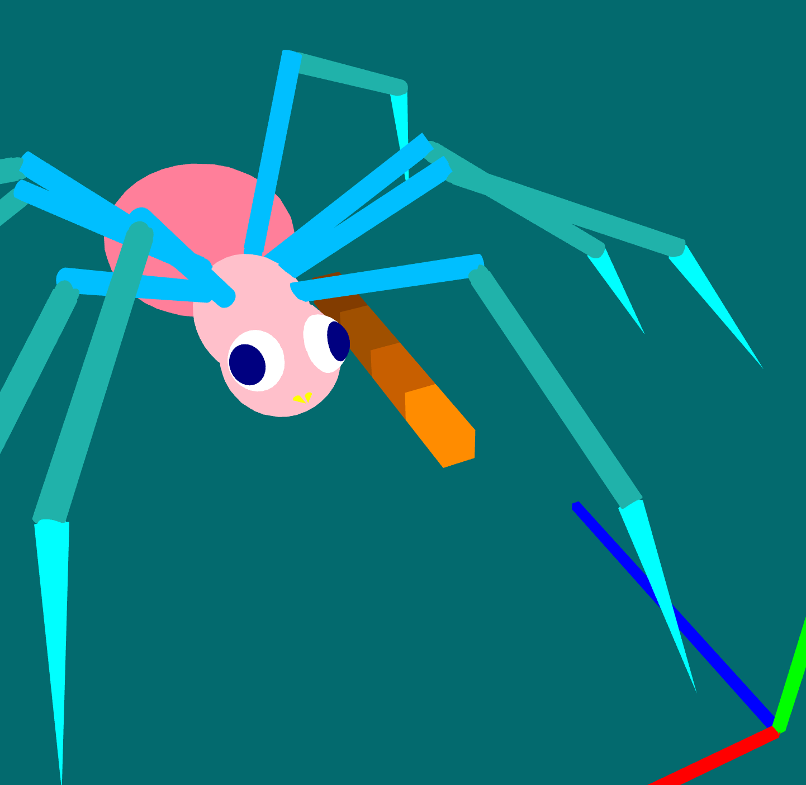

# PA2_Fall2024

## Summary of the code and implementations 
### spider
#### Constructor __init__:

+ Takes parameters: parent, position, shaderProg, and display_obj.
+ Calls the parent class constructor using super() to initialize the component.
+ Creates the spider's downbody (lower body), upbody (upper body), and tailbody (tail) using spheres (Sphere).
+ These body parts are added in a hierarchical manner using addChild.
+ componentList and componentDict are used to store all components and provide easy access by name.
#### Creating Eyes and Pupils:

+ Eyes and pupils are created using create_cp function, with the eyes represented by white spheres and pupils by navy spheres.
Creating Mouth:

+ The left and right mouths are represented using cones (Cone), and are attached to the upper body.
#### Creating Legs:

+ Leg parameters such as radius, joint size, position, and angular adjustments are defined.
+ The leg_i() function creates each leg, constructing both left and right legs with joints and segments. Each leg is composed of multiple joints and segments, represented by spheres, cylinders, and cones. The leg positions and angles are adjusted based on the uvws values.
#### Static Method joint_range:

+ Adjusts the joint's angle range to ensure it can rotate within a reasonable range.
#### Method create_cp:

+ Creates a pair of components, one for the left and one for the right side, and returns both objects.
#### Method create_obj:

+ Creates a shape object (like sphere, cylinder, cone) based on the given parameters, attaches it to the parent, sets default angles, and stores them in the component list and dictionary.
#### Method create_mirror:

Creates a mirrored object by flipping the coordinates and angles, ensuring symmetry between the left and right parts.
### pose
#### pose1
+ If the '1' key is pressed, it looks left.
+ It selects the left and right eye pupils (left_eye_pupil and right_eye_pupil) and appends them to the self.pose_obj list.
A loop adjusts the vAngle (horizontal angle) of each target by adding 10 degrees, simulating a look to the left.

### pose2
+ If the '2' key is pressed, it open mouth.
+ It adjusts the vAngle of the left and right sides of the mouth (left_mouth and right_mouth), moving the left side down by 30 degrees and the right side up by 30 degrees to simulate an eating action.

### pose3
+ If the '3' key is pressed, it make a left leg movement.
+ It calls self.rotate_u_v_w() to rotate several left-side joints (e.g., left_joint_0_0, left_joint_0_1, etc.) by specific u, v, and w angles, simulating a left leg movement.
Some right-side joints are also rotated to simulate coordinated body movement.

### pose4
+ If the '4' key is pressed, it make a right leg movement.
+ It similarly adjusts the right-side joints by calling self.rotate_u_v_w() to simulate a right leg movement.
The left-side joints are also adjusted for balance.

### pose5
+ If the '5' key is pressed. It calls self.rotate_u_v_w() to rotate the tailbody part, making the tail move.

### pose0
+ If the '0' key is pressed, it resets all pose objects.
+ It restores each object's color and angles (default_color, default_uAngle, default_vAngle, default_wAngle) to their default states.
+ It clears the pose_obj list and calls self.update() to refresh the scene and reset all actions.

###  Implement an eye that always looks at the position of the mouse
#### Calculate Viewing Angle:
+ vAngle = self.cameraTheta - math.pi * 3 / 2 % (2 * math.pi) is calculating the viewing angle by subtracting 3 𝜋 / 2 3π/2 from the camera's cameraTheta (azimuth) to adjust the viewing angle range.
+ max_size = 10: This sets a maximum value for the movement range of the pupils, scaling both v_delta and u_delta.
#### Horizontal Angle Check:
+ The condition if vAngle > -0.5*math.pi and vAngle < 0.5 * math.pi: checks if the camera's azimuth (vAngle) is within the visible range, meaning the camera is facing the front (between -90° and 90°). The pupils will only move when the camera is within this range.
+ v_delta = max_size * vAngle / (0.5*math.pi): This calculates the horizontal angle shift for the pupil based on vAngle.
#### Vertical Angle Calculation:

+ u_delta = -max_size * self.cameraPhi / (0.5*math.pi) computes the vertical shift of the pupils based on the camera's cameraPhi (elevation angle).
#### Adjusting Pupil Angles:
+ It retrieves the pupil objects for both the left and right eyes using self.cDict["left_eye_pupil"] and self.cDict["right_eye_pupil"], adding them to self.pose_obj to indicate that they need to be updated.
+ A for loop then adjusts both vAngle (horizontal) and uAngle (vertical) for each pupil object by adding the deltas to their default angles.
#### Update:
+ self.update() triggers an update function, presumably to refresh the scene or apply the new pupil angles, so the eye movement is reflected visually.

